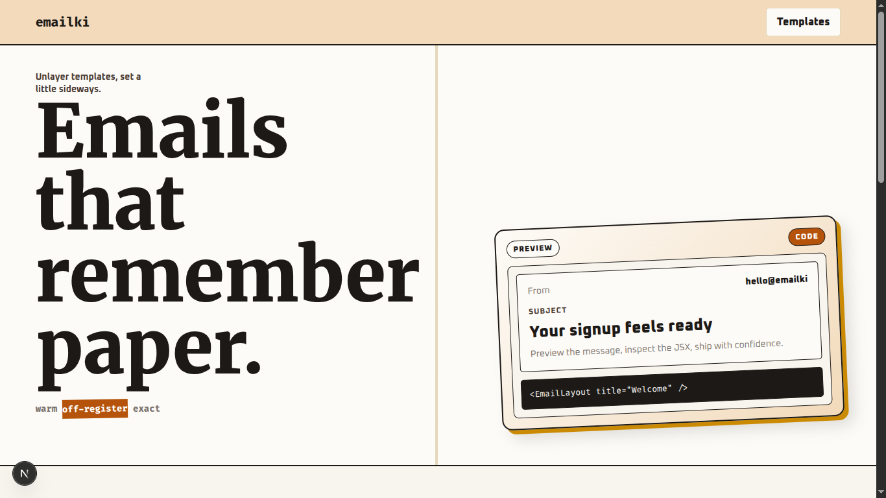
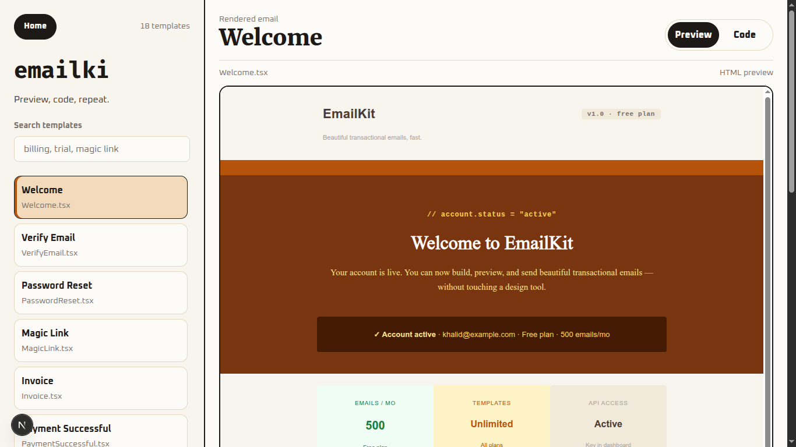
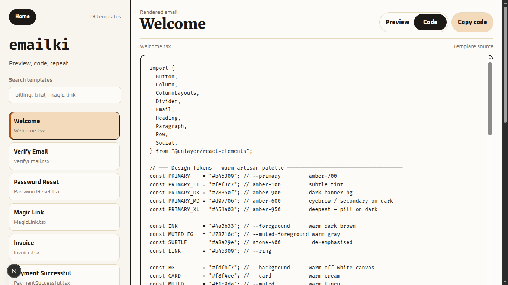

# 📧 Emailki
## SaaS Lifecycle Email Kit

A modern collection of **production-ready SaaS email templates** built entirely with **Unlayer Elements for React**.

This project demonstrates how to build beautiful, reusable, and responsive email templates using only the **@unlayer/react-elements** library without relying on custom HTML email markup.

---

## ✨ Features

- 🎨 Modern SaaS-inspired UI
- ⚛️ Built entirely with **Unlayer Elements**
- 📦 React + TypeScript
- 📱 Fully Responsive
- ♻️ Reusable Components
- 🚀 Production Ready
- 🎯 Easy to Customize
- 💡 Clean & Minimal Design

---

# 📂 Included Templates

| Template | Description |
|----------|-------------|
| 🎉 Welcome | Welcome new users to your platform |
| ✉️ Verify Email | Verify a user's email address |
| 🔑 Magic Link | Passwordless login email |
| 🔒 Password Reset | Reset account password |
| 🚀 Trial Started | Free trial started successfully |
| ⏰ Trial Reminder | Reminder before trial ends |
| ⚠️ Trial Ending | Final reminder before expiration |
| ❌ Trial Expired | Notify users that their trial expired |
| 💎 Subscription Activated | Subscription activation confirmation |
| 🔄 Renewal Reminder | Subscription renewal reminder |
| 🧾 Invoice | Billing invoice |
| 💰 Receipt | Payment receipt |
| ✅ Payment Successful | Successful payment notification |
| ❌ Payment Failed | Failed payment notification |
| 📥 Download Confirmation | Digital download confirmation |
| 📧 Email Changed | Email address updated |
| 🗑️ Account Deleted | Account deletion confirmation |
| 🆕 Changelog | Product updates & release notes |

---

# 📸 Screenshots




---




---





---

# 📁 Project Structure

```text
.
├── app
│   ├── layout.tsx
│   ├── page.tsx
│   └── templates
│       ├── layout.tsx
│       └── page.tsx
│
├── components
│   └── templates
│       ├── AccountDeleted.tsx
│       ├── Changelog.tsx
│       ├── DownloadConfirmation.tsx
│       ├── EmailChanged.tsx
│       ├── Invoice.tsx
│       ├── MagicLink.tsx
│       ├── PasswordReset.tsx
│       ├── PaymentFailed.tsx
│       ├── PaymentSuccessful.tsx
│       ├── Receipt.tsx
│       ├── RenewalReminder.tsx
│       ├── SubscriptionActivated.tsx
│       ├── TrialEnding.tsx
│       ├── TrialExpired.tsx
│       ├── TrialReminder.tsx
│       ├── TrialStarted.tsx
│       ├── VerifyEmail.tsx
│       └── Welcome.tsx
│
├── public
├── styles
├── package.json
├── next.config.ts
├── tsconfig.json
└── README.md
```

---

# 🚀 Getting Started

## 1. Clone the Repository

```bash
git clone https://github.com/khalidkhankakar/emailki
```

```bash
cd emailki
```

---

## 2. Install Dependencies

Using npm

```bash
npm install
```

Using pnpm

```bash
pnpm install
```

Using yarn

```bash
yarn
```

---

## 3. Run Development Server

```bash
npm run dev
```

or

```bash
pnpm dev
```

---

## 4. Open in Browser

```
http://localhost:3000
```

---

# 🎨 Built With

- React
- Next
- TypeScript
- Unlayer Elements
- Tailwind CSS

---

# 🎨 Customization

Every template is a standalone React component.

You can easily customize:

- Logo
- Brand Colors
- Typography
- CTA Buttons
- Email Copy
- Footer
- Social Links
- Product Information
- Billing Details

---

# 📱 Responsive Design

All templates are designed to work across modern email clients and adapt gracefully to desktop and mobile devices.

---

# 🎯 Challenge Requirements

- ✅ Built with React
- ✅ Uses **only Unlayer Elements**
- ✅ Modular Architecture
- ✅ Responsive Layouts
- ✅ Reusable Components
- ✅ Modern SaaS Design
- ✅ Production Ready

---

# 🤝 Contributing

Contributions, issues, and feature requests are welcome.

Feel free to fork this repository and submit a pull request.

---

# 📄 License

This project was created for the **Unlayer Elements Challenge**.

Feel free to use it as inspiration for your own email templates.

---

# 👨‍💻 Author

**Khalid Khan**

- 🌐 Portfolio: https://khalidkakar.pro
- 💼 LinkedIn: https://linkedin.com/in/khalid-khan-kakar1
- 💻 GitHub: https://github.com/khalidkhankakar

---

## ⭐ Show Your Support

If you like this project, consider giving it a ⭐ on GitHub.